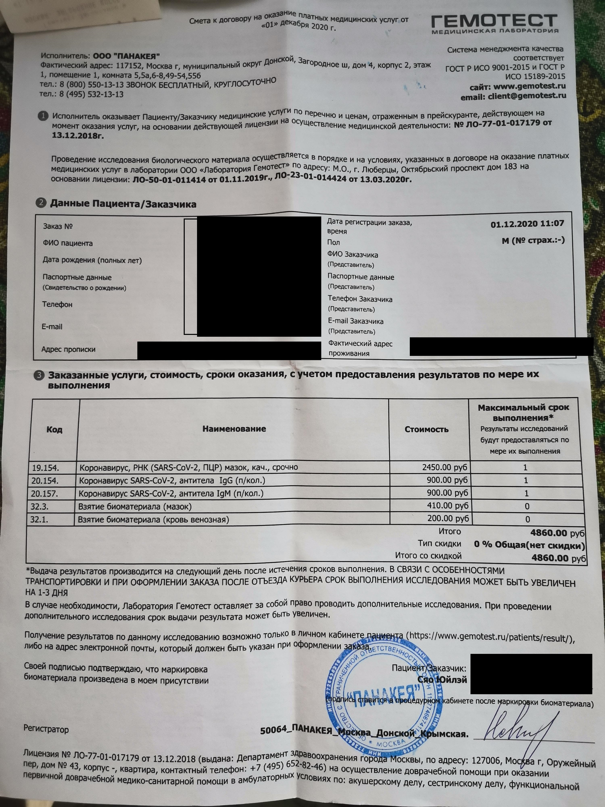
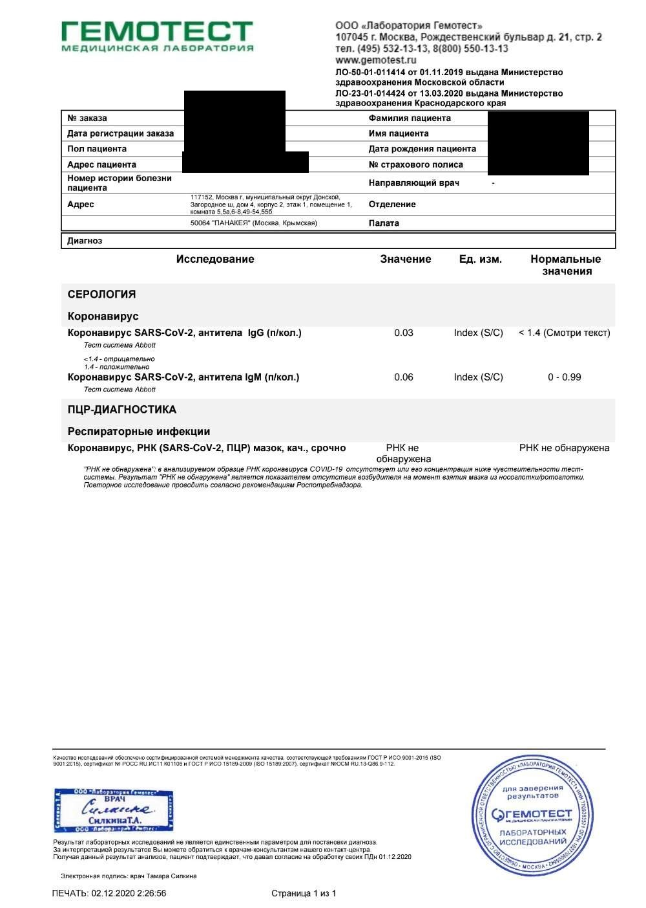
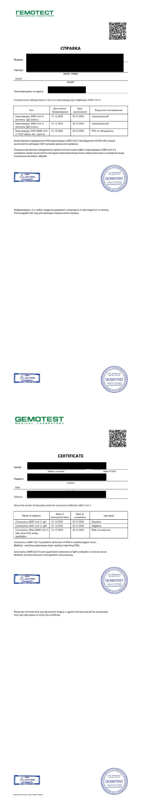
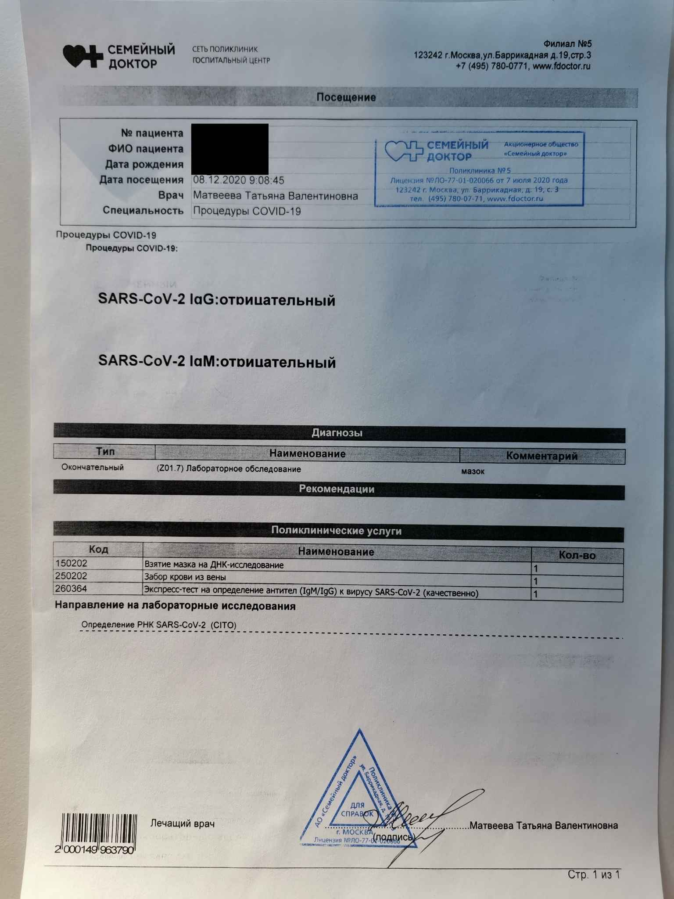
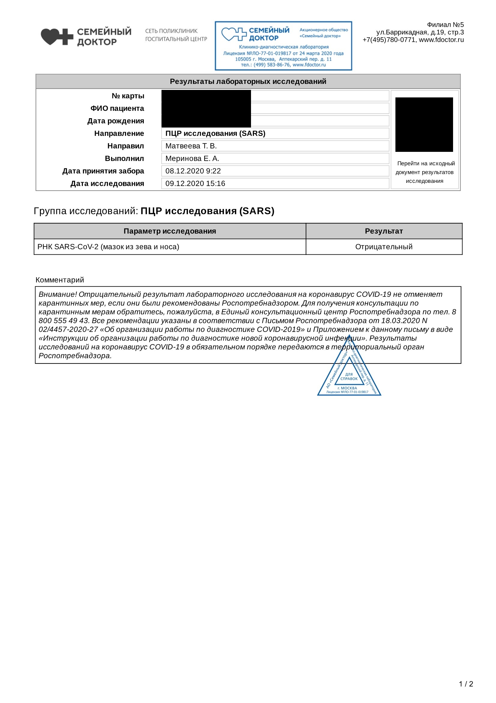

# 俄罗斯莫斯科回国总结

## 整体流程
1. 根据大使馆提供的诊所列表做双阴检查，要求48小时以内的检测结果。注意不是以起飞时间来算48小时，而是以0点开始计算，如果是10号的飞机，那么就是从8号开始，全天任意时间都可以。
2. 拿到检测报告后，通过防疫健康码国际版小程序上传报告给大使馆。
3. 上传成功后，就是等待大使馆审批了，有的人审批很快，有的就很慢，耐心等待。如果有问题被打回，上面会告知原因。最后快值机了还没拿到绿码，就拿起电话去轰炸大使馆吧。
4. 拿到绿码后，把报告要打印一份随身携带，到机场办理值机时，有专人检查绿码和报告。值机后成功后，双阴报告和绿码就完成了它们的使命了。
5. 到了国内就没什么说的了，检查排队去宾馆，全程有人看着你，上厕所都要把护照交上去，要干啥都有人告诉你，没什么可担心的了。

## 双阴报告
最煎熬的就是报告了，这是除了机票外，能决定你是否回国的唯一因素。好多人的回国之路都是在这个步骤就夭折了。除了真的是感染外，还有可能是误检。俄罗斯的检测准确率真是不咋地。遇到一个同胞连续做了两个星期的检测都没问题，结果买了机票后，最后一次检测IgM和IgG都升高了，机票也没法退，你说这上哪说理去。  
莫斯科大使馆指定的4家检测机构中，我用过其中两个：fdoctor和gemotest。
* ***强烈推荐gemotest***，出报告简直是神速，当天上午11点做完，第二天凌晨2点就收到了报告。我觉得半夜两点还在工作的诊所，应该是个好诊所。不用预约，直接去诊所就行，注意检测时间是11:00-15:00。
* fdoctor则是让人非常煎熬，虽然也是加急的，说是一天出结果，结果是早晨8点做，第二天下午4点多才收到，等的让人心里发慌，严重拖后了得到绿码的时间。我最后就因为报告拿的晚，大使馆审批又慢，一直到临起飞还有4个小时的时候才拿到，都已经做好去机场等绿码的准备了。经历过的人才能理解最后那一天是什么感觉，心里老忐忑了。诊所需要提前预约。时间好像全天都可以。
* 据传说labquest也是很快的，但是本人没试过。有兴趣的可以去体验一下。

### 注意事项
* 在诊所填写完资料后，一定要***仔细核对，尤其是护照号、姓名、邮箱、电话***，诊所出错的概率非常高。
* 收费单和报告一定要有诊所的***两个盖章***，详见下图。
* 检查结果和收费单中，其中任何一个一定要有***静脉血***字样，否则大使馆不认
* 据传说大使馆看到***IgM>=0.4就不会给绿码***，但是医学给出的标准是要>=1.1才会认为是阳性，因此做了定量报告的要好好检查下，***医学阴性和大使馆阴性不是一个标准***，上传的时候，自己注意。***传说只要一次红码，一个月内不管检测什么结果，都不会给绿码了***。

### gemotest
* 具体检查项和价格可以看下图，其中PCR和IgM是大使馆要求的必检项，IgG可以不用检。***注意：gemotest的收费单必须跟检测报告一起上传，因为报告中是没有写静脉血的，而是写在了收费单中***  

* gemotest的报告是定性定量两种报告一起出，所以大使馆到底要哪种完全不用纠结。没问题的话申请绿码时全都上传上去就可以了。***一定要同时上传收费单***。  

### fdoctor
这家都懒得说了，具体看收费单和检查报告图片就知道了。报告只有定性结果。速度慢，价格几乎是gemotest的一倍。  
***注意：PCR和IgM的报告是两份分开的***  

## 申请绿码
拿到报告后，就可以使用防疫健康码国际版小程序来填写资料并上传绿码了，有几个***注意事项***：
* ***如果静脉血写在了收费单上，要将收费单和报告一起上传，如gemotest就是这种情况。***
* ***如果之前做过检测并上传过报告申请绿码，最后一次最好将近两次报告的结果都上传。我就是因为只上传了最新的报告，被打回来要求跟前一次的一起上传。***    
* ***如果手机上无法上传成功，可以尝试换个网络，或者用pc版微信上传。***

## 机场值机
值机过程没什么坑，而且速度比没有疫情的时候快多了，因为机场几乎没有什么人，到了机场满眼都是回国的中国人。如果手续齐全，半个小时值机、安检、通关就全结束了。所以也没必要去的太早，提前一个半小时到机场足够了。当然如果要退税还是要提前去办理，我没有要退税的东西，所以很快。据办理了退税的人传说，退税非常慢，一个小时两三个人的速度。

## 飞行过程
俄航飞机要求佩戴口罩和手套。为了防护好一些，我当天带了一个带阀门的3M口罩，结果登机后，空姐说不允许佩戴带阀门的口罩，又给我发了个一次性的医用口罩。但是我也没把3m的拿下来，直接把一次性口罩套在了外面，呼吸还是比较费劲的，也多亏了哥们肺活量大点。飞机上基本90%以上的人都是全服武装，口罩、手套、眼罩、防护服，大部分人都全程不吃不喝不上厕所，当然也有心大的。我也喝了两杯水，憋气，拉开口罩，干杯，带上口罩，再开始呼吸，一气呵成。防护服一定要买透气的，我之前领的防护服外层好像是一层塑料，穿上不透气，下飞机到了宾馆后，脱下来发现牛仔裤都湿透了。

## 上海入关
在出机舱前，先不要急着走，会有中国防疫人员登记来组织分批下机，同时要求乘客登录“海关旅客指尖服务”，进入“健康申报”填写注册信息产生二维码，凭二维码截图才能出舱门，下机之后会过体温自动监测和扫描在飞机上生成的二维码给你一张检测告知书，拿告知书去领两个试管，然后拿着去做核算检测，检测需要检测两边鼻孔、咽喉分泌物和抽血，检测完之后盖章，交表，凭护照入关同时告知最终目的地，提取行李。拿了行李之后就是去排队分流去酒店了，***酒店完全随机分配，排队赶上哪个车就上哪个车***，上海的是单独通道，江苏、浙江、安徽的也是单独的通道，其他省份是一个通道，***其它省份排队人非常多，速度很慢，建议尽快完成前面工作，尽早排队，可以早点到宾馆休息***。排队等车过程中需要扫描一个二维码申报健康状况，获取进港旅客二维码贴在护照后面， 后续的乘车、酒店入住都需要这个二维码。

## 宾馆入住
* 到了酒店基本就没什么其它事情了，填填表，分房间，房间不满意可以在当天要求更换。到了国内基本就是听从安排就行了。
* 不过从隔友的交流来看，外省的酒店普遍都不好，上海本地人的酒店都不错，估计是为了照顾我们这种外省的穷人。
* 另外很多酒店不提供香皂肥皂洗衣粉，洗衣服是个问题，我就直接用洗手液洗了。
* 小部分酒店还没有牙刷牙膏，有的酒店不允许外卖，有的可以外卖，但是只能饭点时间一起送过来。遇到啥样的全看人品了。
顺道吐槽一下酒店的伙食，质量一般般也就算了。这个吃饭点是不是也太早点，早晨7点，中午10:30，晚上16:30，这上海人民吃饭都这么早么？想着晚点吃吧，饭还凉了，房间里面还没地方热饭！

# 本次航班确诊情况记录
12月13日：多人个接到防疫电话说是密接了，目前知道的密接范围内的座位排数有2，5（有确诊），12（有确诊），15，19，31，35，41
12月14日：目前已经确诊11个了，今天刚接到防疫电话，说12D确诊，我跟他同一排，算密接，要单独拉去新的酒店隔离，人生中第一次坐120
