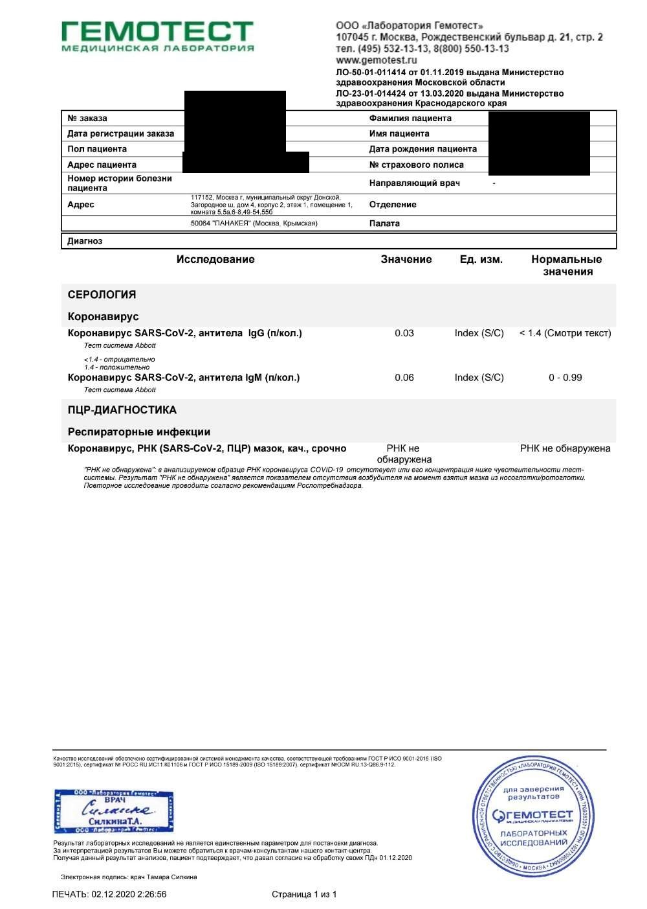
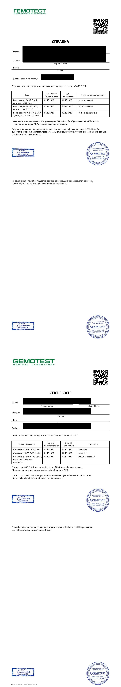

## 准备工作
### 双阴报告
莫斯科大使馆指定的4家检测机构中，我用过其中两个：fdoctor和gemotest。

**强烈推荐gemotest**，出报告简直是神速，当天上午11点做完，第二天凌晨2点就收到了报告。

而fdoctor则是让人非常煎熬，虽然也是加急的，说是一天出结果，结果是早晨8点做，第二天下午4点多才收到，除了等的让人心里发慌外，严重拖后了得到绿码的时间。
#### Gemotest
具体检查项和价格可以看下图，其中PCR和IgM是大使馆要求的必检项，IgG可以不用检。**注意：gemotest的收费单必须跟检测报告一起上传，以为报告中是没有写静脉血的，而是写在了收费单中**

gemotest会一起出两种检查报告，定性和定量的都会出，所以完全不用纠结。没问题的话申请绿码全都上传上去就可以了。

