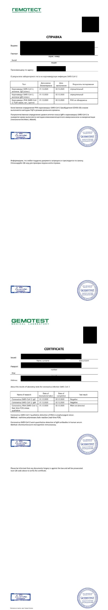

# 莫斯科回国上海入关攻略

## 整体流程
1. 根据大使馆提供的诊所列表做双阴检查，要求48小时以内的检测结果。注意不是以起飞时间来算48小时，而是以0点开始计算，如果是10号的飞机，那么就是从8号开始，全天任意时间都可以。

2. 拿到检测报告后，通过防疫健康码国际版小程序上传报告给大使馆。

    2.1 如果在gemotest做的测试，要将收费单和报告一起上传。
    
    2.2 如果之前上传过报告申请绿码，最后一次最好将最近两次报告的结果都上传。我就是因为只上传了最新的报告，被打回来要求跟前一次的一起上传。
    
    2.3 如果手机无法上传成功，可以尝试换个网络，或者用pc版微信上传。
    
3. 上传成功后，就是等待大使馆审批了，有的人审批很快，有的就很慢，耐心等待。如果有问题被打回，上面会告知原因。最后快值机了还没拿到绿码，就拿起电话去轰炸大使馆吧。

4. 拿到绿码后，把报告要打印一份随身携带，到机场办理值机时，有专人检查绿码和报告。值机后成功后，双阴报告和绿码就完成了它们的使命了。

5. 到了国内就没什么说的了，检查排队去宾馆，全程有人看着你，上厕所都要把护照交上去，要干啥都有人告诉你，没什么可担心的了。

## 双阴报告
莫斯科大使馆指定的4家检测机构中，我用过其中两个：fdoctor和gemotest。

**强烈推荐gemotest**，出报告简直是神速，当天上午11点做完，第二天凌晨2点就收到了报告。不用预约，直接去诊所就行，注意检测时间是11:00-15:00。

而fdoctor则是让人非常煎熬，虽然也是加急的，说是一天出结果，结果是早晨8点做，第二天下午4点多才收到，除了等的让人心里发慌外，严重拖后了得到绿码的时间。我最后就因为报告拿的晚，大使馆审批又慢，一直临起飞还有4个小时的时候才拿到，体会过的人才能理解最后那一天是什么感觉，心里老忐忑了。诊所需要提前预约。时间好像全天都可以。

### 注意事项
在诊所填写完资料后，一定要***仔细核对，尤其是护照号、姓名、邮箱、电话***，诊所出错的概率非常高。
收费单和报告一定要有诊所的**两个盖章**，详见下图。

### gemotest
具体检查项和价格可以看下图，其中PCR和IgM是大使馆要求的必检项，IgG可以不用检。**注意：gemotest的收费单必须跟检测报告一起上传，因为报告中是没有写静脉血的，而是写在了收费单中**

gemotest会一起出两种检查报告，定性和定量的都会出，所以完全不用纠结。没问题的话申请绿码时全都上传上去就可以了。**一定要同时上传收费单**。

### fdoctor
这家都懒得说了，具体看收费单和检查报告图片就知道了。报告只有定性结果。速度慢，价格几乎是gemotest的一倍。

**注意：PCR和IgM的报告是两份分开的**

## 机场值机
值机过程没什么坑，而且速度比没有疫情的时候快多了，因为机场几乎没有什么人，到了机场满眼都是回国的中国人。如果手续齐全，半个小时值机、安检、通关就全结束了。所以也没必要去的太早，提前一个半小时到机场足够了。当然如果要退税还是要提前去办理，我没有要退税的东西，所以很快。据办理了退税的人传说，退税非常慢，一个小时两三个人的速度。

## 上海入关
在出机舱前，先不要急着走，会有中国防疫人员登记来组织分批下机，同时要求乘客登录“海关旅客指尖服务”，进入“健康申报”填写注册信息产生二维码，凭二维码截图才能出舱门，下机之后会过体温自动监测和扫描在飞机上生成的二维码给你一张检测告知书，拿告知书去领两个试管，然后拿着去做核算检测，检测需要检测两边鼻孔、咽喉分泌物和抽血，检测完之后盖章，交表，凭护照入关同时告知最终目的地，提取行李。拿了行李之后就是去排队分流去酒店了，上海的单独通道，江苏、浙江、安徽的又是单独的通道，其他省份是一个通道，排队等车过程中需要扫描一个二维码申报健康状况，获取进港旅客二维码贴在护照后面， 后续的乘车、酒店入住都需要这个二维码。

到了酒店基本就没什么其它事情了，填填表，分房间，房间不满意可以在当天要求更换。到了国内基本就是听从安排就行了，我也刚开始隔离，后续怎么样也没经历过，但是想来应该没什么坑了。
