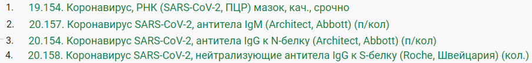

# 2021年俄罗斯莫斯科回国

## 核酸抗体检测流程
![检测流程](http://www.plantuml.com/plantuml/png/ZLPTJzDG6BxlhsWmyS9anC4Im0k27yaa3Z60neGjJSEAB85ksKhCxZPXk0_7G93gjiY6J5294FoWi07_HNjErol_WczJTrPEryKBbfM-p_iyvtcVzy18JEAZqkB2F3CN2Wgii12HucnGYCr4Gn4f51OPPlf6W7MvXjb9YPS4hdyiB4fptAEx4zoeTmn-l4pCUC7seD9xL3f7cRogP5JbCowd_I9A5d55qLFATPoLrVCD_261V-JqdMMKIXlVjsizB1zpRisGvgbzVMaVhQLnfM61tFRvkD59Rlm1uzI21ULKBMcglQlZyXae7a2xd_oY_d4B7rHDlI2zaK1xkG4irr2oXivEjD8wIBTm3zpZuvmRgDXhlj2pESaR5GIHeRY0tbP-Yvt6SWNBE-WYWPUtyVO6AXm7xAeyW-YeWEMVVb4xE53FNe4ukvbMHPx1-zQZqxgi8eWk6jJHSRIswXTL9QisAZYJmEKCpjRGUbRR_DOyFD7gbrebQP7nE38VveCqEqr5HaCGb0FzPeZ028Cx0QTlBYbwec1FpDC9FkwC1VC0Jiopmmq_dE6KztPu7y3jOm-6dujmFfjEO_fWe6twza8AJR9ZkW0ZeK1ahBGu0wJBt_NYPf_7J9HQhy4q0MyhjSUrlOCmjj-990nEhTV1KRrwgYfvCo1-4Lx-ojHkzdfmUWjApEz3RRTQG-SUZazrtzTvOLOoPTXGH0eklj0Q6-QDO-60ppWN4hc9nLWin9C4GZewTQEeA32O1kMM4yB1u4EkgCgk_ZgjRNrfvcIyMjFsyislH-ZyJNk3WOBWhZZWTT0ntAxunsk20qpxzqvXCirsztg0ttQ5k3rmiw6LbEC6kJt6d8rUD9NrBM7wqoWQOtMvU_k7rDCSf2hGbTIwTpIfaIsQXgQcQ-2Ph1QTKvADSiPfH1ODJ_YPcP0ej42WrDnvs2kqaZTlDalvL1HOJEDzy1orPAlLmYI2ywDaiNdviljLFIN49EwEC1kE4Ydj0L17jBudJwtmEiY3SPaN5_W0MSJrAZbXW6uqx2ZfIXkgXoF6jHZf_4SF5GxXui65DVMYHCpgO5FpC8dVhdQZS0WeFgx2yF-dDJCYY47Zdvw_)

## 回国前CheckList
| 序号 | 日期 | 证件 | 说明 |
| --- | ---- | ---- | ---- |
|  1  |  | 护照首页 |   |
|  2  |      | 移民卡（小白条）；居留登记（落地签） | 其中任何一个都可以 |
|  3  |      | 中国境内接种的新冠疫苗证明 | 须注明***接种单位座机联系电话*** |
|  4  | 
***11月26日~12月2日***
 | 自我健康状况监测表 | ***起算时间不含航班起飞当天*** |
|  5  | ***11月12日~12月2日*** | 隔离证明函 | 有关企业须出具隔离证明函，内含回国人员姓名、护照号、隔观起止日期、隔离地点等信息，并加盖企业公章，在申请健康码时一并上传。在俄中资企业项目人员，还须提前21日（按航班起飞日减21日计算）进行隔离观察和闭环管理 |
|  6  | ***11月19日~12月2日*** | 1次核酸 + 1次胸透 | 因打疫苗导致抗体不合格，需要在登机前14日以内额外进行1次核酸和1次胸透检测，申请绿码时一同上传结果 |
|  7  | ***11月26日*** | 核酸检测报告，血清IgM、IgG抗体检测数值报告 | ***最好去Gemotest诊所，与最后航司指定的诊所CMD不同***。（登机前核酸检测及健康监测***起算时间不含航班起飞当天***。如航班起飞日期为9月10日，登机前第7日为9月3日，第一次集中检测应在9月3日当天进行。健康监测时间同理。） |
|  8  | ***12月1日***  | 核酸检测报告，血清IgM、IgG抗体检测数值报告 | 到***航司指定地址CMD诊所检测*** |

## 各诊所检查项 ##
### CMD检查项 ###

### Gemotest检查项###

